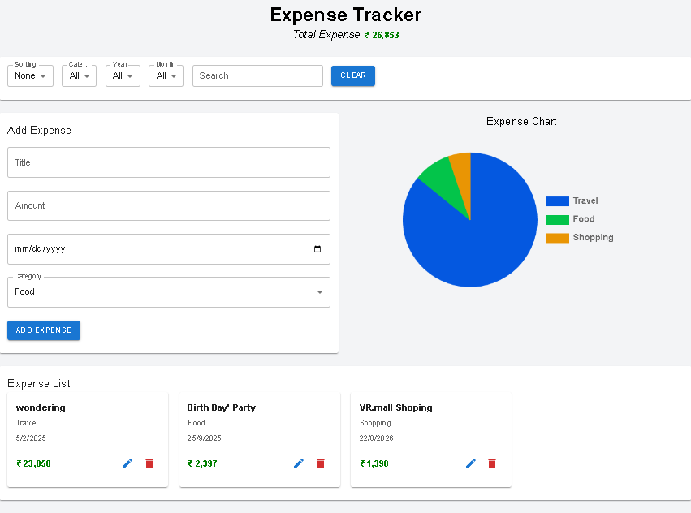

# Expense Tracker

A modern expense tracking web application built using **React + Vite**.
Users can add, edit, delete and analyze their daily expenses with category filtering and visual charts.

## Features

* Add new expenses
* Edit existing expenses
* Delete expenses
* Category filtering
* Search functionality
* Sort by date and amount
* Expense visualization using charts
* Data stored in LocalStorage

## Tech Stack

* React
* Vite
* Material UI
* Chart.js
* JavaScript
* CSS

## Installation

Clone the repository:

git clone https://github.com/imkmalvi/expense-tracker-react.git

Install dependencies:

npm install

Run the project:

npm run dev

Build for production:

npm run build

## Project Structure

src
 ├── components
 ├── hooks
 ├── pages
 ├── utils
 ├── constants

## Author

Kamlesh Malvi

## Screenshots

